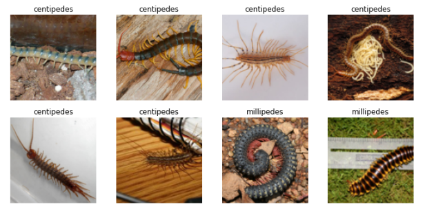

# centipedes_mullipedes_voila
Centipedes vs Millipedes Web App Classifier

Centipedes and millipedes are two creatures that one can encounter in the garden. Centipedes are beneficial to you because they feed on mites, insect larvae,  insects, baby snails, and slugs. Millipedes, on the other hand, can be harmful and feed on plant roots, germinating seeds, and seedlings. Therefore it is beneficial to any gardener to be able to distinguish between the two.

We used AI to help us do precisely that!

Please try the App on Binder (click below)

https://medium.com/the-innovation/web-ai-app-for-gardeners-centipedes-vs-millipedes-6f61ff9156c6
